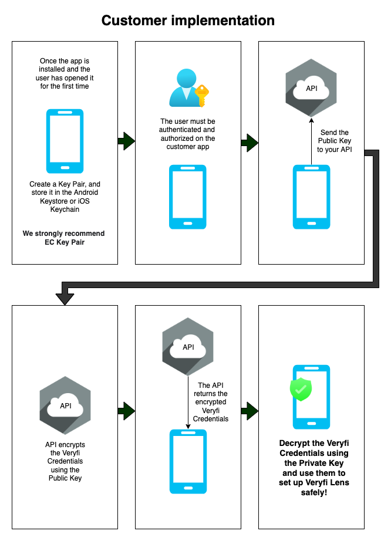

### LENS FOR RECEIPTS & INVOICES


1. [Add Lens Framework to your project](/lens/docs/android/#add-credit-cards)
2. [Configure your project to use Lens Framework](/lens/docs/android/#configure-credit-cards)
3. [Initialize Lens](/lens/docs/android/#init-credit-cards)
4. [Launch Lens inside your App](/lens/docs/android/#launch-credit-cards)
5. [Communicate with Lens](/lens/docs/android/#delegates-credit-cards)
6. [Key security best practices](/lens/docs/android/#key-security-credit-cards)

> Keys: an access key is required to use this service. If you do not have one, you can [generate a key](/api/settings/keys/) now.

#### 1. Add Lens Framework to your project

1. Add the Maven repository details to the `dependencyResolutionManagement.repositories` section of your `settings.gradle` as shown in this minimalistic example:
```js
dependencyResolutionManagement {
    repositories {
        google()
        mavenCentral()

        // Maven repository for VeryfiLens
        maven {
            url "https://nexus.veryfi.com/repository/maven-releases/"
            credentials {
                username = 'USERNAME'
                password = 'PASSWORD'
            }
            authentication {
                basic(BasicAuthentication)
            }
        }
    }
}
```
**NOTE**: Replace `USERNAME` and `PASSWORD` with your real username and password. You can manage your Maven access credentials [here](/api/settings/keys/#package-managers-container).

2. Add Veryfi Lens to the dependencies in your `build.gradle (:app)` file (replace "X.X.X" with the Lens SDK version you're currently using):
```js
implementation 'com.veryfi.lens:veryfi-lens-credit-cards-sdk:X.X.X'
```

---
####  2. Configure your project to use Lens SDK

1. Ensure your build.gradle (:app) file includes at a minimum the following configuration, plus any other required settings:
```js
plugins {
    id 'kotlin-kapt'
}

android {
    defaultConfig {
        minSdkVersion 23

        ndk {
            // Specifies the ABI configurations of your native app
            abiFilters "armeabi-v7a", "arm64-v8a", "x86", "x86_64"
        }

        javaCompileOptions {
            annotationProcessorOptions {
                arguments += [
                    "room.schemaLocation":"$projectDir/schemas".toString(),
                    "room.incremental":"true",
                    "room.expandProjection":"true"]
            }
        }
    }

    androidResources {
        noCompress "veryfi"
    }

    buildFeatures {
        viewBinding true
    }

    // Required if minSdkVersion is set to lower than 26
    compileOptions {
        sourceCompatibility JavaVersion.VERSION_1_8
        targetCompatibility JavaVersion.VERSION_1_8
    }
}
```

2. Ensure your `build.gradle (:app)` file includes at a minimum the following dependencies (replace "X.X.X" with the Lens SDK version you're currently using) as well as the latest **AndroidX** libraries:
```js
dependencies {
    implementation 'androidx.appcompat:appcompat:X.X.X'
    implementation 'com.veryfi.lens:veryfi-lens-credit-cards-sdk:X.X.X.X'
    implementation "org.jetbrains.kotlin:kotlin-stdlib:$kotlin_version"
}
```

3. Ensure your main `build.gradle` file includes the required repositories:
```js
allprojects {
    repositories {
        google()
        mavenCentral()
    }
}

buildscript {
    dependencies {
        classpath 'com.android.tools.build:gradle:7.2.2'
    }
}
```

4. Remove/disable `repositoriesMode` in your `settings.gradle` file :
```js
dependencyResolutionManagement {
    // Disable the following line:
    // repositoriesMode.set(RepositoriesMode.FAIL_ON_PROJECT_REPOS)

    repositories {
        google()
        mavenCentral()
    }
}
```

5. If your app uses the `android:allowBackup` tag, include the following settings in the Activity section of your `AndroidManifest.xml` file :
```js
<application
    tools:ignore="AllowBackup,GoogleAppIndexingWarning"
    tools:replace="android:allowBackup">
```
---

#### 3.  Initialize Lens

1. Import required classes from Lens SDK:
```java
import com.veryfi.lens.VeryfiLens
import com.veryfi.lens.VeryfiLensCredentials
import com.veryfi.lens.VeryfiLensSettings
import com.veryfi.lens.VeryfiLensDelegate
```

2. Configure your [authentication credentials](/api/settings/keys/):
```js
val veryfiLensCredentials = VeryfiLensCredentials()
veryfiLensCredentials.clientId = "XXX"  // replace XXX with your assigned Client Id
veryfiLensCredentials.username = "XXX"  // replace XXX with your assigned Username 
veryfiLensCredentials.apiKey = "XXX"    // replace XXX with your assigned API Key 
veryfiLensCredentials.url = "XXX"       // replace XXX with your assigned Endpoint URL

```

Please read our recommendations on how to secure your credentials [here](/lens/docs/ios/#key-security-receipts-invoices)

3. Configure your Lens settings. Refer to the [full list](/lens/docs/ios/#all-settings) of available settings later in this section.
```js
val veryfiLensSettings = VeryfiLensSettings()
veryfiLensSettings.autoCaptureIsOn = true
veryfiLensSettings.autoRotateIsOn = true
veryfiLensSettings.autoSubmitDocumentOnCapture = true
veryfiLensSettings.documentTypes = arrayListOf(DocumentType.CREDIT_CARD)
veryfiLensSettings.galleryIsOn = false
veryfiLensSettings.moreMenuIsOn = false
```

4. Initialize Lens:
```js
VeryfiLens.configure(this, veryfiLensCredentials, veryfiLensSettings)
```

#### Available settings:
- `docDetectFillUIColor`: document detection rectangle fill color (default: *"#9653BF8A"*)
- `docDetectStrokeUIColor`: document detection rectangle stroke color (default: *null*)

**NOTE**: In the case when the settings menu is disabled for the user (`moreSettingsMenuIsOn` is set to false), Lens will use the settings that it is initialized with. If the settings menu is enabled, the user will by default be presented with the configured values, but will be able to change these within the settings menu.

---

#### 4. Launch Lens inside your App
1. Launch the Lens camera:
```js
VeryfiLens.showCamera()
```

---

#### 5. Communicate with Lens
1. Use the `VeryfiLens.setDelegate` function to define your delegate functions that will be responsible for handling events triggered by Veryfi Lens:
```js
VeryfiLens.setDelegate(object : VeryfiLensDelegate {
    override fun veryfiLensClose(json: JSONObject) {
        Log.d(TAG, json.toString(2)) // do something with the JSON response here
    }

    override fun veryfiLensError(json: JSONObject) {
        Log.d(TAG, json.toString(2)) // do something with the JSON response here
    }

    override fun veryfiLensSuccess(json: JSONObject) {
        Log.d(TAG, json.toString(2)) // do something with the JSON response here
    }

    override fun veryfiLensUpdate(json: JSONObject) {
        Log.d(TAG, json.toString(2)) // do something with the JSON response here
    }
})
```
#### Delegate Definitions
- `veryfiLensClose` - the Veryfi Lens camera has been closed, either as a result of submitting a credit card for processing, or the user closed the camera without submitting a card.

Sample data:
```json
{
  "status": "close",
  "queue_count": 1,
  "session_scan_count": 1,
  "framework-version": "1.4.0",
  "framework-build": "1"
}
```
**TIP**: In the object above, `queue_count` refers to the number of submitted documents 
that are currently in the processing queue. `session_scan_count` refers to the number 
of documents that were submitted in the most recent Lens camera session - if this 
is equal to 0 (zero) then the camera session was canceled without submitting anything.

- `veryfiLensUpdate` - during the processing of a credit card, this delegate will be fired multiple times.

Sample *package created* data:
```json
{
  "status": "start",
  "package_id": "edc8653e4c2b4ef1"
}
```

- `veryfiLensSuccess` - this delegate fires once a credit card has finished processing.This delegate provides the response from the data extraction.

Sample data:
```json
{
    "status": "done",
    "msg": "results",
    "data": {
      "card_number": "5143 3201 1937 4709",
      "card_name": "ALEJANDRO URIBE",
      "card_type": "mastercard",
      "card_dates": [
        "1\/10",
        ""
      ]
    },
    "package_id": "f7d3d73ba7264742"
}
```

- `veryfiLensError` - if an error occurs during processing a submitted card, an error object is sent. If a general exception or crash is caught in Veryfi Lens, an exception object is sent instead.

Sample *error* data:
```json
{
    "status": "error",
    "package_id": "f7d3d73ba7264742",
    "error": "Error message"
}
```

---

#### 6.  Key security best practices
The recommended flow for this process is:



The above process secures Veryfi credentials by preventing:

1. **Reverse engineering attacks**: Since the credentials are not being stored as part of the app source code it is not possible to get them through reverse engineering tools such as Apktool
2. **Man in the middle attacks**: Only the Public Key is sent to the API to encrypt your Veryfi credentials. This means the credentials are not accessible even if an attacker performs a Man in the Middle attack, Proxy attack, SSL attack, or similar because the credentials are encrypted and the Private Key is required to decrypt them. The Private Key is only accessible to the app that creates it
3. **Other attacks**: Since the Key Pair used for encrypting/decrypting the Veryfi credentials is created on app install and stored in Android Keystore or iOS Keychain, they’re not accessible to attackers. This is thanks to protection mechanisms supplied by the OS on the device.

**API Notes:**

The API must use HTTPS with strong encryption and Veryfi credentials must be securely stored at rest on the back end.

**Customer App Notes:**

- Once the credentials are decrypted on the customer app, they may be stored securely on the device to avoid the need to fetch the Veryfi credentials after each user login. If this approach is taken, it must be done using EcryptedSharedPreferences on Android or using Keychain on iOS.
- If feasible, consider also implementing SSL pinning in iOS applications to further mitigate man-in-the-middle attacks. Before doing so, please make sure that this is appropriate for your application as this can lead to your app becoming unusable if this isn’t implemented correctly. SSL pinning requires fallback strategies to be implemented to cater for future SSL certificate changes.

---

**Please note:** adding the Lens SDK to your app will increase your final app size by up to ~20MB. This is due to machine learning models, support libraries, etc included in the SDK.