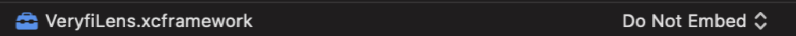

### LENS FOR CREDIT CARDS


1. [Add Lens Framework to your project](/lens/docs/ios/#add-credit-cards)
2. [Configure your project to use Lens Framework](/lens/docs/ios/#configure-credit-cards)
3. [Initialize Lens](/lens/docs/ios/#init-credit-cards)
4. [Launch Lens inside your App](/lens/docs/ios/#launch-credit-cards)
5. [Communicate with Lens](/lens/docs/ios/#delegates-credit-cards)
6. [Prepare your app for the App Store](/lens/docs/ios/#itunes-credit-cards)
7. [Key security best practices](/lens/docs/ios/#key-security-credit-cards)

> Keys: an access key is required to use this service. If you do not have one, you can [generate a key](/api/settings/keys/) now.

---

#### 1. Add Lens Framework to your project
**Note:** The below steps assume that you already have Cocoapods installed and initialized in your project. If you're new to Cocoapods, visit the [official site](https://guides.cocoapods.org/using/getting-started.html) to get started.

1. Open your project's *Podfile*
2. Add the Veryfi private Cocoapods repository as a source at the top of the *Podfile*
```shell
source 'https://repo.veryfi.com/shared/lens/veryfi-lens-podspec.git'
```
3. You can add your credentials with **git credential** tool, so you don't need to login each time you install or update Lens, by running **git credential approve** in your command line terminal. You should fill the following and tap enter twice:
```shell
protocol=https
host=repo.veryfi.com
path=shared/lens/veryfi-lens-podspec.git
username=YOUR_USERNAME
password=YOUR_PASSWORD
```

4. Add the VeryfiLens pod to your target
```shell
pod 'VeryfiLens-CreditCards'
```

5. A minimal version of your *Podfile* should look similar to this:
```shell
source 'https://repo.veryfi.com/shared/lens/veryfi-lens-podspec.git'
source 'https://github.com/CocoaPods/Specs.git'

target 'VeryfiLensExample' do
    use_frameworks!

    # Pods for VeryfiLensExample
    pod 'VeryfiLens-CreditCards'
end
```

6. You need valid credentials to pull the Lens SDK from Veryfi's private repository. You can manage your credentials [here](/api/settings/keys/#package-managers-container).

You can store your credentials with the `git credential` tool, so you don’t need to log in each time you install or update Lens. Here's one example of using this tool (replace `USERNAME` and `PASSWORD` with your credentials):

```xml
git credential approve <<EOF
protocol=https
host=repo.veryfi.com
path=shared/lens/veryfi-lens-podspec.git
username=USERNAME
password=PASSWORD

EOF
```

7. Install the pod by running this command in the Terminal, in the root folder of your project:
```shell
pod install
```

---

#### 2. Configure your project to use Lens SDK
1. Go to *Target > General*, then under Frameworks, Libraries, and Embedded Content add **VeryfiLens.framework** by pressing "+" and set Embed to Do not Embed
   
2. Go to your app's *Target > Build Settings*, scroll down to the *Build Options* section and configure the following:
- Enable Bitcode: NO
- Validate Workspace: YES

3. Add the following to your app's plist:
- This permission is mandatory so Lens can scan and process your receipts:
```xml
<key>NSCameraUsageDescription</key>
<string>Scan documents</string>
```

- These permissions are mandatory if you support gallery backups/usage:
```xml
<key>NSLocationAlwaysAndWhenInUseUsageDescription</key>
<string>Helps to identify places around you</string>
<key>NSLocationWhenInUseUsageDescription</key>
<string>Helps to identify places around you</string>
```

---

#### 3.  Initialize Lens

1. Import required symbols from Lens SDK:
```xml
import VeryfiLens
```

2. Configure your [authentication credentials](/api/settings/keys/):
```js
let CLIENT_ID = "XXX" // replace XXX with your assigned Client Id
let AUTH_USERNAME = "XXX" // replace XXX with your assigned Username
let AUTH_APIKEY = "XXX" // replace XXX with your assigned API Key
let URL = "XXX" // replace XXX with your assigned Endpoint URL

let veryfiLensCredentials = VeryfiLensCredentials(clientId: CLIENT_ID,
    username: AUTH_USERNAME,
    apiKey: AUTH_APIKEY,
    url: URL)
```

Please read our recommendations on how to secure your credentials [here](/lens/docs/ios/#key-security-receipts-invoices)

3. Configure your Lens settings. Refer to the [full list](/lens/docs/ios/#all-settings) of available settings later in this section.
```js
let veryfiLensSettings = VeryfiLensSettings()
veryfiLensSettings.autoCaptureIsOn = true
veryfiLensSettings.autoRotateIsOn = true
veryfiLensSettings.dataExtractionEngine = VeryfiInApp
veryfiLensSettings.documentTypes = ["credit_card"]
veryfiLensSettings.galleryIsOn = false
veryfiLensSettings.moreMenuIsOn = false
```

4. Initialize Lens:
```js
VeryfiLens.shared().configure(with: veryfiLensCredentials, settings: veryfiLensSettings)

```

#### Available settings:
- `docDetectFillUIColor`: document detection rectangle fill color (default: *"#9653BF8A"*)
- `docDetectStrokeUIColor`: document detection rectangle stroke color (default: *null*)


---

#### 4. Launch Lens inside your App
1. Launch the Lens camera:
```js
VeryfiLens.shared().showCamera(in: self)
```

2. Your app will need to communicate with Lens to handle user actions, various status changes and extraction results from Veryfi. See the [Communicating with Lens](/lens/docs/ios/#delegates-credit-cards) section below for details

---
#### 5. Communicate with Lens
1. Set your delegate:
```js
VeryfiLens.shared().delegate = self
```

2. Implement the delegate methods:
```js
extension ViewController: VeryfiLensDelegate {
    func veryfiLensClose(_ json: [String : Any]) {
        let jsonData = try? JSONSerialization.data(withJSONObject: json as Any, options: .prettyPrinted)
        let jsonString = String(data: jsonData!, encoding: .utf8)
        print(String("veryfiLensClose: " + jsonString!))   // do something with the JSON here
    }

    func veryfiLensUpdate(_ json: [String : Any]) {
        let jsonData = try? JSONSerialization.data(withJSONObject: json as Any, options: .prettyPrinted)
        let jsonString = String(data: jsonData!, encoding: .utf8)
        print(String("veryfiLensUpdate: " + jsonString!))   // do something with the JSON here
    }

    func veryfiLensSuccess(_ json: [String : Any]) {
        let jsonData = try? JSONSerialization.data(withJSONObject: json as Any, options: .prettyPrinted)
        let jsonString = String(data: jsonData!, encoding: .utf8)
        print(String("veryfiLensSuccess: " + jsonString!))   // do something with the JSON here
    }

    func veryfiLensError(_ json: [String : Any]) {
        let jsonData = try? JSONSerialization.data(withJSONObject: json as Any, options: .prettyPrinted)
        let jsonString = String(data: jsonData!, encoding: .utf8)
        print(String("veryfiLensError: " + jsonString!))   // do something with the error JSON here
    }
}
```

#### Delegate Definitions
- `veryfiLensClose` - the Veryfi Lens camera has been closed, either as a result of submitting a credit card for processing, or the user closed the camera without submitting an image.

Sample data:
```json
{
  "status": "close",
  "queue_count": 1,
  "framework-version": "1.5.7",
  "session_scan_count": 1,
  "framework-build": "49"
}
```

**NOTE**: In the object above, `queue_count` refers to the number of submitted documents that are currently in the processing queue. `session_scan_count` refers to the number of documents that were submitted in the most recent Lens camera session - if this is equal to 0 (zero) then the camera session was canceled without submitting anything.

- `veryfiLensUpdate` - during the processing of a document, this delegate will be fired multiple times. One time it will contain the thumbnail path for the submitted document and one time it will contain a full-size image path. In addition, multiple instances of this delegate will be fired containing the current upload progress percentage.

Sample *package created* notification:

```json
{
  "status": "start",
  "package_id": "5kY9hXlb0COeg5n07y71"
}
```

Sample *thumbnail path* notification:
```json
{
  "status": "inprogress",
  "msg": "img_thumbnail_path",
  "data": "/path/to/thumbnail.jpg",
  "package_id": "5kY9hXlb0COeg5n07y71"
}
```

Sample *full-size image path* data:
```json
{
  "status": "inprogress",
  "msg": "img_original_path",
  "data": "/path/to/image.jpg",
  "package_id": "5kY9hXlb0COeg5n07y71",
  "document_type": "credit_card"
}
```

Sample *package removed* notification data:
```json
{
  "status": "removed",
  "msg": "clear_package",
  "package_id": "5kY9hXlb0COeg5n07y71"
}
```

- `veryfiLensError` - if an error occurs during uploading or processing a submitted or a general exception or crash is caught in Veryfi Lens, this notification contains the error details.

Sample *error* data:
```json
{
  "status": "error",
  "package_id": "edc8653e4c2b4ef1",
  "error": "[Wombat].Reachability.noInternetConnection"
}
```

- `veryfiLensSuccess` - this delegate fires once a credit card has finished processing, This delegate provides the response from Veryfi models.

Sample data:
```json
{
  "status": "done",
  "msg": "results",
  "data": {
    "card_number": "5143 3201 1937 4709",
    "card_name": "ALEJANDRO URIBE",
    "card_type": "mastercard",
    "card_dates": [
      "1\/10",
      ""
    ]
  },
  "package_id": "5kY9hXlb0COeg5n07y71"
}
```

---

#### 6. Prepare your app for the App Store

1. Go to your app's *Target > Build Phases*
2. Make sure VeryfiLens.xcframework is included in the *Embedded Frameworks* section

--- 

#### 7.  Key security best practices
The recommended flow for this process is:


The above process secures Veryfi credentials by preventing:

1. **Reverse engineering attacks**: Since the credentials are not being stored as part of the app source code it is not possible to get them through reverse engineering tools such as Apktool
2. **Man in the middle attacks**: Only the Public Key is sent to the API to encrypt your Veryfi credentials. This means the credentials are not accessible even if an attacker performs a Man in the Middle attack, Proxy attack, SSL attack, or similar because the credentials are encrypted and the Private Key is required to decrypt them. The Private Key is only accessible to the app that creates it
3. **Other attacks**: Since the Key Pair used for encrypting/decrypting the Veryfi credentials is created on app install and stored in Android Keystore or iOS Keychain, they’re not accessible to attackers. This is thanks to protection mechanisms supplied by the OS on the device.

**API Notes:**

The API must use HTTPS with strong encryption and Veryfi credentials must be securely stored at rest on the back end.

**Customer App Notes:**

- Once the credentials are decrypted on the customer app, they may be stored securely on the device to avoid the need to fetch the Veryfi credentials after each user login. If this approach is taken, it must be done using EcryptedSharedPreferences on Android or using Keychain on iOS.
- If feasible, consider also implementing SSL pinning in iOS applications to further mitigate man-in-the-middle attacks. Before doing so, please make sure that this is appropriate for your application as this can lead to your app becoming unusable if this isn’t implemented correctly. SSL pinning requires fallback strategies to be implemented to cater for future SSL certificate changes.

---

**Please note:** adding the Lens SDK to your app will increase your final app size by up to ~20MB. This is due to machine learning models, support libraries, etc included in the SDK.