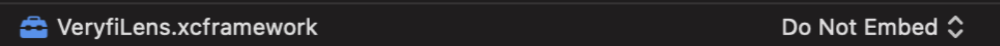

### LENS FOR LONG CPG RECEIPTS


1. [Add Lens Framework to your project](/lens/docs/ios/#add-long-receipts)
2. [Configure your project to use Lens Framework](/lens/docs/ios/#configure-long-receipts)
3. [Initialize Lens](/lens/docs/ios/#init-long-receipts)
4. [Launch Lens inside your App](/lens/docs/ios/#launch-long-receipts)
5. [Communicate with Lens](/lens/docs/ios/#delegates-long-receipts)
6. [Prepare your app for the App Store](/lens/docs/ios/#itunes-long-receipts)
7. [Key security best practices](/lens/docs/ios/#key-security-long-receipts)

> Keys: an access key is required to use this service. If you do not have one, you can [generate a key](/api/settings/keys/) now.

---

#### 1. Add Lens Framework to your project
**Note:** The below steps assume that you already have Cocoapods installed and initialized in your project. If you're new to Cocoapods, visit the [official site](https://guides.cocoapods.org/using/getting-started.html) to get started.

1. Open your project's *Podfile*
2. Add the Veryfi private Cocoapods repository as a source at the top of the *Podfile*
```shell
source 'source 'https://repo.veryfi.com/shared/lens/veryfi-lens-podspec.git''
```
3. You can add your credentials with **git credential** tool, so you don't need to login each time you install or update Lens, by running **git credential approve** in your command line terminal. You should fill the following and tap enter twice:
```shell
protocol=https
host=repo.veryfi.com
path=shared/lens/veryfi-lens-podspec.git
username=YOUR_USERNAME
password=YOUR_PASSWORD
```

4. Add the VeryfiLens pod to your target
```shell
pod 'VeryfiLens'
```

5. A minimal version of your *Podfile* should look similar to this:
```shell
source 'https://repo.veryfi.com/shared/lens/veryfi-lens-podspec.git'
source 'https://github.com/CocoaPods/Specs.git'

target 'VeryfiLensExample' do
    use_frameworks!

    # Pods for VeryfiLensExample
    pod 'VeryfiLens'
end
```

6. You need valid credentials to pull the Lens SDK from Veryfi's private repository. You can manage your credentials [here](/api/settings/keys/#package-managers-container).

You can store your credentials with the `git credential` tool, so you don’t need to log in each time you install or update Lens. Here's one example of using this tool (replace `USERNAME` and `PASSWORD` with your credentials):

```xml
git credential approve <<EOF
protocol=https
host=repo.veryfi.com
path=shared/lens/veryfi-lens-podspec.git
        username=USERNAME
        password=PASSWORD

        EOF
```

7. Install the pod by running this command in the Terminal, in the root folder of your project:
```shell
pod install
```

---

#### 2. Configure your project to use Lens SDK
1. Go to *Target > General*, then under Frameworks, Libraries, and Embedded Content add **VeryfiLens.framework** by pressing "+" and set Embed to Do not Embed
   
2. Go to your app's *Target > Build Settings*, scroll down to the *Build Options* section and configure the following:
- Enable Bitcode: NO
- Validate Workspace: YES

3. Add the following to your app's plist:
- This permission is mandatory so Lens can scan and process your receipts:
```xml
<key>NSCameraUsageDescription</key>
<string>Scan documents</string>
```

- These permissions are mandatory if you support gallery backups/usage:
```xml
<key>NSPhotoLibraryAddUsageDescription</key>
<string>Back up your document images in your photo gallery</string>
<key>NSPhotoLibraryUsageDescription</key>
<string>Choose document images to process from your photo gallery</string>
```

- These permission is mandatory if you want to support speech recognition (Voice):
```xml
<key>NSSpeechRecognitionUsageDescription</key>
<string>Quickly add transactions via voice dictation</string>
<key>NSMicrophoneUsageDescription</key>
<string>Quickly add transactions via voice dictation</string>
```

- These permissions are mandatory if you want to support location:
```xml
<key>NSLocationAlwaysAndWhenInUseUsageDescription</key>
<string>Helps to identify places around you</string>
<key>NSLocationWhenInUseUsageDescription</key>
<string>Helps to identify places around you</string>
```

- These permissions are optional, you must enable them if you want to support contacts (email) or calendar integration:
```xml
<key>NSContactsUsageDescription</key>
<string>Add your ___@veryfi.cc assigned email address for reference</string>
<key>NSCalendarsUsageDescription</key>
<string>Enrich your data with business meetings and events from your Calendar</string>
```

---

#### 3.  Initialize Lens

1. Import required symbols from Lens SDK:
```xml
import VeryfiLens
```

2. Configure your [authentication credentials](/api/settings/keys/):
```js
let CLIENT_ID = "XXX" // replace XXX with your assigned Client Id
let AUTH_USERNAME = "XXX" // replace XXX with your assigned Username
let AUTH_APIKEY = "XXX" // replace XXX with your assigned API Key
let URL = "XXX" // replace XXX with your assigned Endpoint URL

let veryfiLensCredentials = VeryfiLensCredentials(clientId: CLIENT_ID,
        username: AUTH_USERNAME,
        apiKey: AUTH_APIKEY,
        url: URL)
```

Please read our recommendations on how to secure your credentials [here](/lens/docs/ios/#key-security-receipts-invoices)

3. Configure your Lens settings. Refer to the [full list](/lens/docs/ios/#all-settings) of available settings later in this section.
```js
let veryfiLensSettings = VeryfiLensSettings()
veryfiLensSettings.documentTypes = ["long_receipt"]
veryfiLensSettings.blurDetectionIsOn = true
veryfiLensSettings.autoLightDetectionIsOn = true
veryfiLensSettings.backupDocsToGallery = true
veryfiLensSettings.docDetectionAndCropIsOn = true
veryfiLensSettings.closeCameraOnSubmit = true
veryfiLensSettings.stitchIsOn = true
veryfiLensSettings.locationServicesIsOn = true
veryfiLensSettings.moreMenuIsOn = true
veryfiLensSettings.categories = ["Meals", "Entertainment", "Job supplies"]
```

4. Enable background upload support. Add the below to your AppDelegate:
```js
import AWSS3

func application(_ application: UIApplication, handleEventsForBackgroundURLSession identifier: String, completionHandler: @escaping () -> Void) {
// Store the completion handler
   AWSS3TransferUtility.interceptApplication(application, handleEventsForBackgroundURLSession: identifier, completionHandler: completionHandler)
}
```

5. Initialize Lens:
```js
VeryfiLens.shared().configure(with: veryfiLensCredentials, settings: veryfiLensSettings)
```

#### Available settings:
- `autoCropGalleryIsOn`: forces document detection and auto cropping on documents imported from the image gallery (default: *false*)
- `autoDeleteAfterProcessing`: if on, scanned files will be deleted once processing has completed (default: *false*)
- `autoDocDetectionAndCropIsOn`: detects, highlights and crops documents automatically during camera image capture (default: *true*)
- `autoLightDetectionIsOn`: if on the room ambience controls light to illuminate the document. Turn OFF for manual controls (default: *true8)
- `autoRotateIsOn`: automatically rotates image so the contained document is correctly oriented (default: *false*)
- `autoSubmitDocumentOnCapture`: auto submit document on capture, skipping the preview screen (default: *false*)
- `backupDocsToGallery`: uses photo gallery to backup each scans -- NOTE: must ask user for permission (default: *true*)
- `blurDetectionIsOn`: checks if a picture captured has 20% or more blur - blurred receipts don't process well (default: *true*)
- `boostModeIsOn`: flag that tells Veryfi whether boost mode should be enabled (default: *false*)
- `boundingBoxesIsOn`: returns coordinates for where fields are located on the document (default: *false*)
- `categories`: optional list of custom categories for Veryfi to use in categorizing submitted documents (default: *null*)
- `checksBackIsOn`: enables/disables the capture of checks back side after front side is taken (default: *false*)
- `closeCameraOnSubmit`: after submitting an image, the Lens camera view will be closed and user returned to the host app (default: *true*)
- `confidenceDetailsIsOn`: enable some scores about the confidence level of the inference (default: *false*)
- `detectBlurResponseIsOn`: enables is_blurry which represents the model's assessment about whether the document is blurred or not (default: *false*)
- `dictateIsOn`: enables/disables the "Add by voice" option (default: *true*)
- `docDetectFillUIColor`: document detection rectangle fill color (default: *"#9653BF8A"*)
- `docDetectStrokeUIColor`: document detection rectangle stroke color (default: *null*)
- `emailCCDomain`: the domain name used to power emailed documents (default: *"veryfi.cc"*)
- `emailCCIsOn`: enables/disables the email cc view inside settings (default: *true*)
- `externalId`: a pass-through field to add a unique reference identifier for a scan which can be used to map back to your system (default: *""*)
- `galleryIsOn`: enables/disables the photo gallery feature (default: *true*)
- `locationServicesIsOn`: enables/disables location services to grab user's lat & lng (default: *true*)
- `manualCropIsOn`: toggles the option to manually crop an image before submitting it for processing (default: *true*)
- `moreMenuIsOn`: enables/disables the showing of the more menu (default: *true*)
- `moreSettingsMenuIsOn`: enables/disables the showing of the More > Settings option. NOTE: When this is FALSE all Settings come from the app, not the user (default: *true*)
- `multipleDocumentsIsOn`: enables/disables processing multiple stitched images as different transactions, this requires stitchIsOn (default: *true*)
- `originalImageMaxSizeInMB`: maximum size in MB applied when producing images. Valid range is: 0.2 to 2.5 (default: *2.5*)
- `returnStitchedPDF`: provides path of stitched PDF (when multiple images are stitched for a single document) in the veryfiLensUpdate delegate function (default: *false*)
- `rotateDocIsOn`: enables option to rotate (on each press) a document by 90 degree clockwise (default: *true*)
- `saveLogsIsOn`: stores logs on device. Recommended to be enabled to aid with debugging if required (default: *true*)
- `shareLogsIsOn`: enables option on preview screen to share logs for debugging. Recommended to be disabled in production (default: *false*)
- `shieldProtectionIsOn`: adds shield icon to capture button and adds an menu option inside More > What is Shield? (default: *true*)
- `showDocumentTypes`: enables/disables the documentTypes setting. When disabled, the default camera experience will be used and all documents will be treated as either a receipt, invoice or bill (auto-detected) (default: *false*)
- `stitchIsOn`: enables/disables the option to combine multiple receipts together into a PDF (default: *true*)
- `stitchedPDFPixelDensityMultiplier`: multiplier for the image resolution being drawn on the PDF. Valid range is: 1.0 to 5.0 (default: *2.0*)
- `submitButtonBackgroundColor`: color used for submit button background (default: *#005AC1*)
- `submitButtonBorderColor`: color used for submit button border (default: *#005AC1*)
- `submitButtonCornerRadius`: number used to set submit button corner radius (default: *30*)
- `submitButtonFontColor`: color used for submit button text (default: *#FFFFFF*)

**NOTE**: In the case when the settings menu is disabled for the user (`moreSettingsMenuIsOn` is set to *false*), Lens will use the settings that it is initialized with. If the settings menu is enabled, the user will by default be presented with the configured values, but will be able to change these within the settings menu.

---

#### 4. Launch Lens inside your App
1. Launch the Lens camera:
```js
VeryfiLens.shared().showCamera(in: self)
```

2. Optionally, instead of launching the Lens camera experience, you may perform one of the following:

- Launch the Gallery screen to submit images from the Photo Gallery:
```js
VeryfiLens.shared().showGallery(in: self)
```

- Launch the Dictation screen to submit images either typed or dictated by voice:
```js
VeryfiLens.shared().showDictation(in: self)
```

- Open email collection instructions screen, including the email address the user should forward documents to:
```js
VeryfiLens.shared().showEmail(in: self)
```

**TIP**: Collection email addresses can either exist on the veryfi.cc domain, or your own whitelisted domain. Contact support@veryfi.com for details on whitelabeling.

3. For all of the above features, with the exception of *showEmail()*, your app will need to [communicate with Lens](/lens/docs/ios/#delegates-long-receipts) to handle user actions, various status changes and extraction results from Veryfi. See the Communicating with Lens section below for details

---

#### 5. Communicate with Lens

1. Set your delegate:
```js
VeryfiLens.shared().delegate = self
```

2. Implement the delegate methods:
```js
extension ViewController: VeryfiLensDelegate {
func veryfiLensClose(_ json: [String : Any]) {
    let jsonData = try? JSONSerialization.data(withJSONObject: json as Any, options: .prettyPrinted)
    let jsonString = String(data: jsonData!, encoding: .utf8)
    print(String("veryfiLensClose: " + jsonString!))   // do something with the JSON here
}

   func veryfiLensUpdate(_ json: [String : Any]) {
       let jsonData = try? JSONSerialization.data(withJSONObject: json as Any, options: .prettyPrinted)
       let jsonString = String(data: jsonData!, encoding: .utf8)
       print(String("veryfiLensUpdate: " + jsonString!))   // do something with the JSON here
   }

   func veryfiLensSuccess(_ json: [String : Any]) {
       let jsonData = try? JSONSerialization.data(withJSONObject: json as Any, options: .prettyPrinted)
       let jsonString = String(data: jsonData!, encoding: .utf8)
       print(String("veryfiLensSuccess: " + jsonString!))   // do something with the JSON here
   }

   func veryfiLensError(_ json: [String : Any]) {
       let jsonData = try? JSONSerialization.data(withJSONObject: json as Any, options: .prettyPrinted)
       let jsonString = String(data: jsonData!, encoding: .utf8)
       print(String("veryfiLensError: " + jsonString!))   // do something with the error JSON here
   }
}
```
#### Delegate Definitions
- `veryfiLensClose` - the Veryfi Lens camera has been closed, either as a result of submitting a credit card for processing, or the user closed the camera without submitting an image.

Sample data:
```json
{
  "status": "close",
  "queue_count": 1,
  "framework-version": "1.5.7",
  "session_scan_count": 1,
  "framework-build": "49"
}
```

**NOTE**: In the object above, `queue_count` refers to the number of submitted documents that are currently in the processing queue. `session_scan_count` refers to the number of documents that were submitted in the most recent Lens camera session - if this is equal to 0 (zero) then the camera session was canceled without submitting anything.

- `veryfiLensUpdate` - during the processing of a document, this delegate will be fired multiple times. One time it will contain the thumbnail path for the submitted document and one time it will contain a full-size image path. In addition, multiple instances of this delegate will be fired containing the current upload progress percentage.

Sample *package created* notification:

```json
{
   "status": "start",
   "package_id": "edc8653e4c2b4ef1"
}
```

Sample *thumbnail path* notification:
```json
{
   "status": "inprogress",
   "msg": "img_thumbnail_path",
   "data": "/path/to/thumbnail.jpg",
   "package_id": "edc8653e4c2b4ef1"
}
```

Sample *full-size image path* data:
```json
{
   "status": "inprogress",
   "msg": "img_thumbnail_path",
   "data": "/path/to/thumbnail.jpg",
   "package_id": "edc8653e4c2b4ef1"
}
```

Sample *upload progress percentage* data:
```json
{
   "status": "inprogress",
   "msg": "progress",
   "data": 68,
   "package_id": "edc8653e4c2b4ef1"
}
```

Sample *package removed* notification data:
```json
{
   "status": "removed",
   "msg": "clear_package",
   "package_id": "edc8653e4c2b4ef1"
}
```

- `veryfiLensError` - if an error occurs during uploading or processing a submitted or a general exception or crash is caught in Veryfi Lens, this notification contains the error details.

Sample *error* data:
```json
{
   "status": "error",
   "package_id": "edc8653e4c2b4ef1",
   "error": "[Wombat].Reachability.noInternetConnection"
}
```

- `veryfiLensSuccess` - this delegate fires once a credit card has finished processing, This delegate provides the response from Veryfi models.

Sample data:
```json
{
   "status":"done",
   "package_id":"edc8653e4c2b4ef1",
   "data":{
      "abn_number":"",
      "account_number":"",
      "bill_to_address":"",
      "bill_to_name":"",
      "card_number":"",
      "category":"Meals & Entertainment",
      "created":"2021-01-14 05: 19: 51",
      "currency_code":"USD",
      "date":"2021-01-14 05: 19: 51",
      "delivery_date":"",
      "discount":0,
      "due_date":"",
      "external_id":"",
      "id":31428417,
      "img_file_name":"xxxxxxxxx.png",
      "img_thumbnail_url":"https: \/\/cdn.veryfi.com\/partner-receipts\/xxxxxxxxx_t.png",
      "img_url":"https: \/\/cdn.veryfi.com\/partner-receipts\/xxxxxxxxx.png",
      "incoterms":"",
      "insurance":"",
      "invoice_number":"",
      "line_items":[],
      "notes":"",
      "ocr_text":"starbucks 23.4",
      "order_date":"",
      "payment_display_name":"",
      "payment_terms":"",
      "payment_type":"",
      "phone_number":"",
      "purchase_order_number":"",
      "reference_number":"VBDEC-0000",
      "service_end_date":"",
      "service_start_date":"",
      "ship_date":"",
      "shipping":0,
      "subtotal":23.4,
      "tags":[],
      "tax":0,
      "tip":0,
      "total":23.4,
      "total_weight":"",
      "vat_number":"",
      "vendor":{
         "address":"",
         "fax_number":"",
         "name":"Starbucks",
         "phone_number":"",
         "raw_name":"Starbucks",
         "vendor_logo":"https: \/\/cdn.veryfi.com\/logos\/us\/910419611.png",
         "vendor_type":""
      }
   }
}
```

Sample *dictated expense* data:
```json
{
    "status":"done",
    "package_id":"edc8653e4c2b4ef1",
    "data":{
       "abn_number":"",
       "account_number":"",
       "bill_to_address":"",
       "bill_to_name":"",
       "card_number":"",
       "category":"Meals & Entertainment",
       "created":"2021-01-14 05: 19: 51",
       "currency_code":"USD",
       "date":"2021-01-14 05: 19: 51",
       "delivery_date":"",
       "discount":0,
       "due_date":"",
       "external_id":"",
       "id":31428417,
       "img_file_name":"xxxxxxxxx.png",
       "img_thumbnail_url":"https: \/\/cdn.veryfi.com\/partner-receipts\/xxxxxxxxx_t.png",
       "img_url":"https: \/\/cdn.veryfi.com\/partner-receipts\/xxxxxxxxx.png",
       "incoterms":"",
       "insurance":"",
       "invoice_number":"",
       "line_items":[],
       "notes":"",
       "ocr_text":"starbucks 23.4",
       "order_date":"",
       "payment_display_name":"",
       "payment_terms":"",
       "payment_type":"",
       "phone_number":"",
       "purchase_order_number":"",
       "reference_number":"VBDEC-0000",
       "service_end_date":"",
       "service_start_date":"",
       "ship_date":"",
       "shipping":0,
       "subtotal":23.4,
       "tags":[],
       "tax":0,
       "tip":0,
       "total":23.4,
       "total_weight":"",
       "vat_number":"",
       "vendor":{
          "address":"",
          "fax_number":"",
          "name":"Starbucks",
          "phone_number":"",
          "raw_name":"Starbucks",
          "vendor_logo":"https: \/\/cdn.veryfi.com\/logos\/us\/910419611.png",
          "vendor_type":""
       }
    },
    "type":"dictation"
}
```


---

#### 6. Prepare your app for the App Store

1. Go to your app's *Target > Build Phases*
2. Make sure VeryfiLens.xcframework is included in the *Embedded Frameworks* section

--- 

#### 7.  Key security best practices
The recommended flow for this process is:


The above process secures Veryfi credentials by preventing:

1. **Reverse engineering attacks**: Since the credentials are not being stored as part of the app source code it is not possible to get them through reverse engineering tools such as Apktool
2. **Man in the middle attacks**: Only the Public Key is sent to the API to encrypt your Veryfi credentials. This means the credentials are not accessible even if an attacker performs a Man in the Middle attack, Proxy attack, SSL attack, or similar because the credentials are encrypted and the Private Key is required to decrypt them. The Private Key is only accessible to the app that creates it
3. **Other attacks**: Since the Key Pair used for encrypting/decrypting the Veryfi credentials is created on app install and stored in Android Keystore or iOS Keychain, they’re not accessible to attackers. This is thanks to protection mechanisms supplied by the OS on the device.

**API Notes:**

The API must use HTTPS with strong encryption and Veryfi credentials must be securely stored at rest on the back end.

**Customer App Notes:**

- Once the credentials are decrypted on the customer app, they may be stored securely on the device to avoid the need to fetch the Veryfi credentials after each user login. If this approach is taken, it must be done using EcryptedSharedPreferences on Android or using Keychain on iOS.
- If feasible, consider also implementing SSL pinning in iOS applications to further mitigate man-in-the-middle attacks. Before doing so, please make sure that this is appropriate for your application as this can lead to your app becoming unusable if this isn’t implemented correctly. SSL pinning requires fallback strategies to be implemented to cater for future SSL certificate changes.

---

**Please note:** adding the Lens SDK to your app will increase your final app size by up to ~20MB. This is due to machine learning models, support libraries, etc included in the SDK.